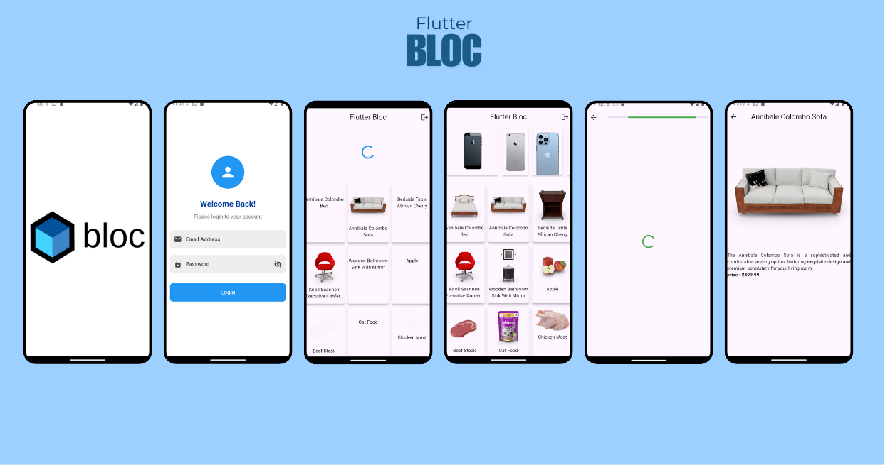

```markdown
# Clean Architecture Flutter App



This Flutter app demonstrates a clean architecture pattern using the following features:

## Features
- **Splash Screen**: Provides an initial loading screen for the app.
- **Login Screen**: Includes user authentication functionality.
- **Home Screen**: Displays the main content of the app.
- **Details Screen**: Shows detailed information based on user interaction.
- **Logout Button**: Allows users to safely log out of the app.

## App Architecture
The app follows the **Clean Architecture** principle, dividing the codebase into distinct layers:
1. **Common**: Shared utilities and constants.
2. **Data**: Handles API requests, local data storage, and repository implementation.
3. **Domain**: Contains use cases and entities.
4. **Presentation**: Manages UI and state using **BLoC** (Business Logic Component) pattern.

## State Management
The app uses **flutter_bloc** and **bloc** packages for state management, ensuring predictable and scalable application state.

## Packages Used
- [`flutter_bloc`](https://pub.dev/packages/flutter_bloc): State management library.
- [`bloc`](https://pub.dev/packages/bloc): Core library for business logic components.
- [`equatable`](https://pub.dev/packages/equatable): Simplifies equality checks in Dart objects.
- [`http`](https://pub.dev/packages/http): HTTP client for making REST API calls.
- [`hive`](https://pub.dev/packages/hive): Lightweight and fast key-value database.
- [`hive_flutter`](https://pub.dev/packages/hive_flutter): Integration of Hive with Flutter.
- [`fluttertoast`](https://pub.dev/packages/fluttertoast): Displays toast messages for user feedback.
- [`cached_network_image`](https://pub.dev/packages/cached_network_image): Efficiently caches and displays images from the network.

## Getting Started
1. Clone the repository:
   ```bash
   git clone https://github.com/4ayyappadasks/cleanarchetectureflutterguy.git
   ```
2. Navigate to the project directory:
   ```bash
   cd cleanarchetectureflutterguy
   ```
3. Install dependencies:
   ```bash
   flutter pub get
   ```
4. Run the app:
   ```bash
   flutter run
   ```

## Folder Structure
```plaintext
lib/
├── common/          # Shared constants and utilities
├── data/            # Data layer (API, local database, repositories)
├── domain/          # Domain layer (Entities, use cases)
├── presentation/    # Presentation layer (UI, BLoC)
```

## Screenshots
  
  
  


---

Feel free to explore the app and provide your valuable feedback! 😊
```

### Key Notes:
1. Replace the `assets/splash.png`, `assets/login.png`, etc., in the **Screenshots** section with the appropriate image paths in your repository.
2. The image you provided (`FLutterbloc.png`) is included at the top of the README under the heading.

You can now add this `README.md` file to your repository for a clean and professional presentation.